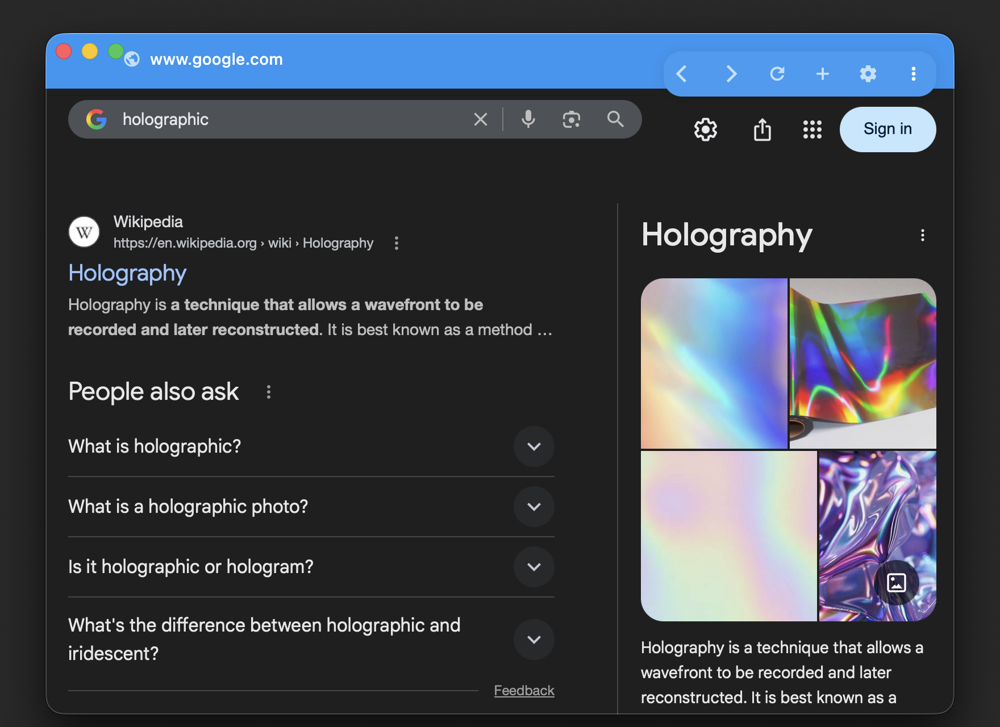

# Browser

Flutter desktop web browser with tabs, bookmarks, history.



## Install

```bash
git clone https://github.com/bniladridas/browser.git
cd browser
flutter pub get
cp .env.example .env  # Fill in Firebase credentials from your Firebase project
flutterfire configure --platforms macos  # This will generate platform-specific files and may overwrite lib/firebase_options.dart
git checkout -- lib/firebase_options.dart # Restore the version that uses environment variables
flutter run
```

**Note:** Do not commit .env to version control. It contains sensitive Firebase keys.

## Develop

Requires Flutter >=3.0.0.

Run `./check.sh` for checks.

Build: `flutter build macos`.

## macOS Unsigned Install (No Paid Apple Dev Account)
Unsigned builds will trigger macOS Gatekeeper warnings. This is expected without a
paid Developer ID and notarization.

### First Launch Steps
1. Drag `browser.app` to Applications.
2. Right-click `browser.app` and choose **Open**, then **Open** again.
3. Or go to **System Settings → Privacy & Security** and click **Open Anyway**.

### Power-User Override
```bash
xattr -rd com.apple.quarantine /Applications/browser.app
```
Only run this if you trust the source.

## Need Help?

See the documentation and project notes:
- `docs/`
- `.codex/README.md`

For bugs or questions, use GitHub Issues.

### Generated Files

This project uses `.gitattributes` to mark generated files (e.g., from `freezed`, `build_runner`) as `linguist-generated`. This hides them from GitHub diffs and language statistics, keeping pull requests focused on hand-written code.

Common generated paths include:
- `build/**` and `.dart_tool/**` (Flutter build artifacts)
- `lib/**/*.freezed.dart` and `lib/**/*.g.dart` (code-generated Dart files)
- Platform-specific directories like `android/**`, `ios/**`

To unmark a specific file, add `-linguist-generated` in `.gitattributes`.

## Contribute

Fork, branch, edit, commit, PR.

## License
This project is proprietary software. See [LICENSE](LICENSE) for full terms.
Copyright (c) 2026 Niladri Das (bniladridas). All Rights Reserved.
